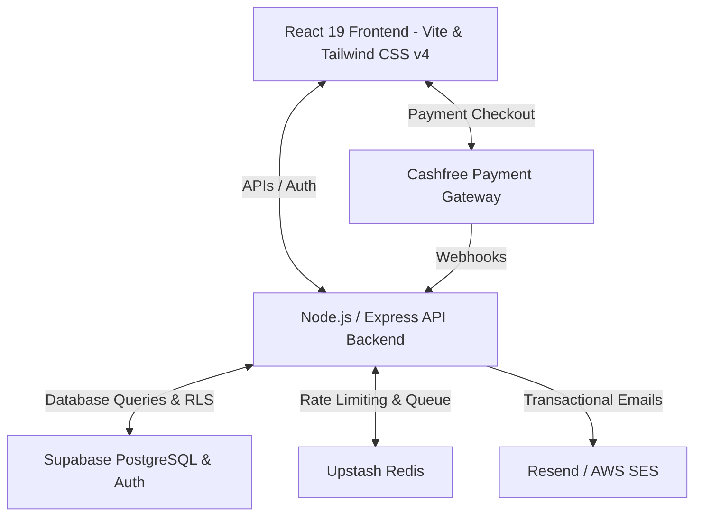

# AWS Student Community Day Dhule 2026 — Ticketing & Registration Portal

Welcome to the official ticketing, registration, and management portal for the **AWS Student Community Day (SCD) Dhule 2026**. 

This is the largest student-led cloud event in the North Maharashtra region, held on **14 August 2026** at the **SVKM's IOT Campus, Dhule**. This monorepo hosts both the interactive React-based user interface and the production-ready Node.js/Express API backend.

---

## 🏗️ Architecture & System Overview

The system is designed as a secure, fast, and scalable registration platform with the following structure:



### Monorepo Components:
1. **Frontend (`client/`)**: A Single Page Application (SPA) built using React 19, TypeScript, and Vite. It utilizes Tailwind CSS v4 for layouts, Framer Motion for smooth micro-animations, and GSAP/Lenis for premium scrolling and visuals. It handles interactive ticket selection, attendee registration, a ticket badge preview, speaker/sponsor registration forms, and an admin/scanner interface.
2. **Backend (`server/`)**: A TypeScript Express.js REST API. It handles checkout session initialization, Cashfree webhook verification, QR code verification, ticket check-ins, application form processing, and transactional ticket emails.
3. **Database (`Supabase/PostgreSQL`)**: Uses Row-Level Security (RLS) policies, transactional database functions (RPCs) to handle seat reservations safely under high concurrency, and automated cleanups for abandoned registrations.

---

## 🚀 Key Features

*   **Secure Ticket Reservation**: Built-in race-condition prevention using custom PL/pgSQL database functions (`reserve_tickets`, `release_tickets`) to ensure tickets cannot be oversold.
*   **Payment Gateway Integration**: Embedded checkout flow with Cashfree Payments, secured with cryptographic signature verification of `Payment Success` webhooks.
*   **Dynamic Badge Generator**: Generates customized physical/digital conference badges for registered attendees.
*   **QR Check-in Scanner**: Integrated HTML5 QR Code scanning route (`/scanner`) for event organizers to check in attendees at the venue in real-time.
*   **Speaker & Sponsor Applications**: Forms for community members to submit CFPs (Call for Proposals) and sponsorship applications.
*   **Admin Dashboard**: Manage active settings (like toggling registrations), view live ticket sales, check speaker/sponsor statuses, and run administrative overrides.
*   **Clean-up Schedulers**: Active background jobs to release reserved tickets if checkouts are abandoned for more than 15 minutes, and archive registrations if unpaid after 24 hours.

---

## 📁 Directory Structure

```text
aws-scd-2026/
├── client/                 # React 19 Frontend Application
│   ├── src/
│   │   ├── components/     # Reusable layout sections (Hero, Tickets, FAQ, etc.)
│   │   ├── features/       # Core modules (ticketing, scanner, admin, speaker)
│   │   ├── lib/            # Supabase and utility configurations
│   │   └── types/          # TypeScript definitions
│   ├── index.html          # Entry HTML page
│   ├── package.json        # Frontend dependencies & scripts
│   └── vite.config.ts      # Vite configuration
│
├── server/                 # Express.js Backend API
│   ├── src/
│   │   ├── features/       # Modular backend routers (passes, checkout, webhooks, scanner, admin)
│   │   ├── shared/         # Shared libraries (Supabase connection, error handler, middleware)
│   │   └── app.ts          # Main application file and background processes
│   ├── Dockerfile          # Production Docker configuration
│   └── package.json        # Backend dependencies & scripts
│
├── markdown/               # Architecture references & deployment instructions
│   ├── schema.sql          # Full Database schema dump
│   ├── deployment-guide.md # Vercel & Render step-by-step guides
│   ├── aws-ses-setup.md    # Instructions to configure Amazon SES
│   └── cashfree-webhook-guide.md # Webhook integration instructions
│
├── run-dev.ps1             # Local development launch script
└── README.md               # You are here
```

---

## 🛠️ Local Installation & Setup

### Prerequisites
*   [Node.js](https://nodejs.org/) (v18+ recommended)
*   A [Supabase](https://supabase.com) project
*   [Upstash Redis](https://upstash.com) database (for queueing and rate limiting)
*   A [Cashfree Test/Production account](https://www.cashfree.com/) (for payments)
*   A [Resend](https://resend.com) API Key or verified [AWS SES](https://aws.amazon.com/ses/) account (for email delivery)

### Step 1: Clone the Repository
```bash
git clone <repository-url>
cd aws-scd-2026
```

### Step 2: Configure Environment Variables

Create `.env` files in both `client/` and `server/` directories based on the following configurations.

#### Frontend Environment (`client/.env`)
```env
VITE_API_URL=http://localhost:3001
VITE_SUPABASE_URL=https://your-supabase-project.supabase.co
VITE_SUPABASE_ANON_KEY=your-anon-key
```

#### Backend Environment (`server/.env`)
```env
# Server Details
PORT=3001
NODE_ENV=development
FRONTEND_URL=http://localhost:3000
SERVER_URL=http://localhost:3001

# Database Configuration
SUPABASE_URL=https://your-supabase-project.supabase.co
SUPABASE_SERVICE_ROLE_KEY=your-service-role-key

# Payments Configuration
CASHFREE_APP_ID=your-cashfree-app-id
CASHFREE_SECRET_KEY=your-cashfree-secret-key

# Security & Tokens
QR_HMAC_SECRET=your-secure-qr-hmac-hash-key
ADMIN_SECRET=your-admin-page-password
SCANNER_SECRET=your-scanner-passcode

# Email Provider Configuration (Resend, Mailtrap, or AWS SES)
EMAIL_PROVIDER=resend             # Use "resend", "mailtrap", or "ses"
EMAIL_FROM=no-reply@yourdomain.com
RESEND_API_KEY=your-resend-api-key
MAILTRAP_API_KEY=your-mailtrap-api-key # Used for OTP and Admin Broadcast Emails

# If using AWS SES:
AWS_SES_REGION=ap-south-1
AWS_ACCESS_KEY_ID=your-aws-access-key
AWS_SECRET_ACCESS_KEY=your-aws-secret-key

# Caching & Queue
UPSTASH_REDIS_REST_URL=https://your-redis-url.upstash.io
UPSTASH_REDIS_REST_TOKEN=your-redis-token
```

### Step 3: Install Dependencies

Run `npm install` inside both the frontend and backend folders:
```bash
# Install frontend packages
cd client
npm install

# Install backend packages
cd ../server
npm install
```

### Step 4: Database Setup

Set up your Supabase Database by executing the SQL statements provided in [schema.sql](file:///markdown/schema.sql) in the **Supabase SQL Editor**.
This script:
1. Creates the required tables: `app_settings`, `pass_types`, `orders`, `registrations`, `payments`, `speaker_applications`, `sponsor_applications`, `email_jobs`, `email_logs`.
2. Inserts default functions for ticket reservations (`reserve_tickets`, `release_tickets`, etc.).
3. Enables Row Level Security (RLS) policies.

---

## 🏃 Running the Application

### Option A: Using the PowerShell Script (Windows)
In the root directory, run:
```powershell
./run-dev.ps1
```
This script will spawn both the Vite frontend server (port `3000`) and the TSX watch server (port `3001`) in parallel.

### Option B: Running Manually
Open two terminal instances:

*   **Terminal 1 (Frontend)**:
    ```bash
    cd client
    npm run dev
    ```
*   **Terminal 2 (Backend)**:
    ```bash
    cd server
    npm run dev
    ```

You can access the client UI at `http://localhost:3000` and backend checks at `http://localhost:3001/api/health`.

---

## 🌐 Production Deployment

Refer to [deployment-guide.md](file:///markdown/deployment-guide.md) for full step-by-step instructions.

### 1. Backend: Deploying to Render
*   Create a Web Service pointing to your GitHub repository.
*   Set the **Root Directory** to `server`.
*   Set the Build Command to `npm install && npm run build`.
*   Set the Start Command to `npm start`.
*   Fill in all environment variables from `server/.env`.

### 2. Frontend: Deploying to Vercel
*   Create a project on Vercel pointing to the root of the repository.
*   Configure the project build command (Vercel auto-detects Vite).
*   Add environment variables (`VITE_SUPABASE_URL`, `VITE_SUPABASE_ANON_KEY`, and `VITE_API_URL` pointing to your Render backend URL).

### 3. Post-Deployment Linkup
*   Update `FRONTEND_URL` on Render to match your Vercel domain.
*   Configure the Webhook URL in your Cashfree Developer Dashboard to:
    `https://your-backend-render-domain.onrender.com/api/webhooks/cashfree`

---

## 📄 Documentation Index
*   **Database Schema Details**: See [schema.sql](file:///markdown/schema.sql) for database table attributes and relationships.
*   **Cashfree Webhooks Setup**: Learn how payments are verified in [cashfree-webhook-guide.md](file:///markdown/cashfree-webhook-guide.md).
*   **Email Deliverability**: Configure AWS SES settings with [aws-ses-setup.md](file:///markdown/aws-ses-setup.md).
*   **Full Deployment Instructions**: Access [deployment-guide.md](file:///markdown/deployment-guide.md).

---

Developed for **AWS Student Community Day Dhule 2026**.
